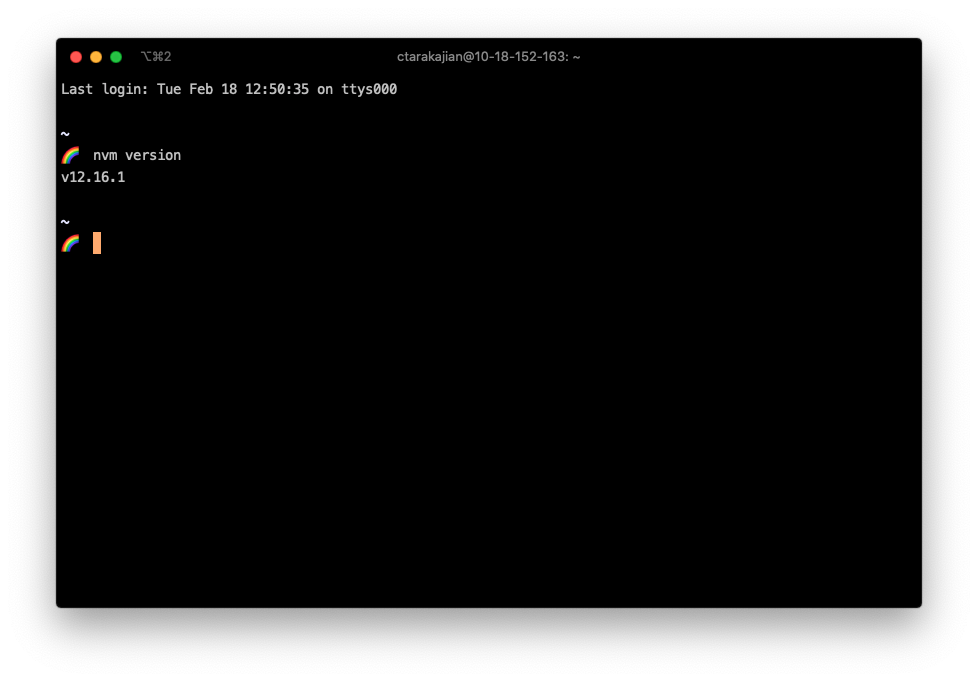

# Back End Foundations Workbook

This workbook accompanies [Week 4 of the DWD class](https://github.com/itp-dwd/2020-spring/blob/master/weeks/04_back-end-foundations.md), and covers the main points in the [Week 4 slides](https://docs.google.com/presentation/d/1jE6lTeUDnePIjwSl2h4lP3K0glPqUfMDSr_HKdaNGm0/edit?usp=sharing).

## Overview

### 00 Instal Node
**Challenge**:
- Follow the [Installing Node.js guide](https://github.com/itp-dwd/2020-spring/blob/master/guides/installing-nodejs.md).
- Install `nvm` on your computer
- Install the LTS (Long term stable) version of Node
- Set the LTS version of Node to your default version
- Check the installed version by running `nvm version`

### 01 Run JavaScript from the Node REPL
**Challenge**:
-  Start the Node REPL by running `node` on the command line
-  Create a variable called `greeting`, and assign it to "Hello DWD!"
-  Inspect the value of `greeting` using console.log
-  Create a function called `greet` that takes a name as an argument, and returns a String "Hello, <name>!"
-  Call `greet` with the argument "Cassie"
-  exit the REPL by inputting `.exit`
  
**Solution**: [01_solution](./workbook/01_solution.png)

### 02 Creating and running a Node script
**Challenge**:
- `cd` to a folder to hold work for this workbook, e.g. `back-end-foundations-workbook-solutions`
- Create a file called `main.js`
- Write any code you want that uses `console.log`
- Save the file
- Execute the code by running `node main.js`, and you should see the console output in the command line

**Solution**: [02_solution](./workbook/02_solution)

### 03 Using Node core libraries
**Challenge**:
- Create a file called `pizzaToppings.json`.
- Copy the contents this [Pizza Toppings JSON](https://raw.githubusercontent.com/dariusk/corpora/master/data/foods/pizzaToppings.json) file to `pizzaToppings.json`.
- Create a file called `pizzaGenerator.js`.
- Import the `fs` (File System) core library. 
- Import the contents of the file into your JS using `readFileSync`.
- Parse the contents of the file as JSON.
- Use the topping choices to generate a random pizza.
- Output your random pizza as a string using `console.log`
- Run your script from the command line and generate a few random pizzas.

**Solution**: [03_solution](./workbook/03_solution)

### 04 `npm install` and `npmjs.com`
**Challenge**:
- Go to the website https://npmjs.com
- Search "metal name"
- Click on a library called "metal-name"
- Take some time to look at the usage instructions, and to look at the project on GitHub
- Go back and search "food words"
- Click on a library called "food-words"
- Install both of these libraries locally by running `npm install <library-name>`
- Notice that this creates a folder called `node_modules` and a file called `package-lock.json`
- Write a script that combines these two libraries in a fun way.

**Solution**: [04_solution](./workbook/04_solution)

### 05 `npm init`, `.gitignore`, `npm install --save`
**Challenge**:
- Copy all of the files from Challenge 04 into a new folder for Challenge 05.
- run `npm init` within from within that folder.
- fill in all of the information (what is in parenthesis is the default value)
- open the file that was just created, `package.json` and take a look at the contents
- run `npm install --save metal-name`
- run `npm install --save food-words`
- look again at the contents of `package.json`, do you notice anything different?
- open the folder in finder by running `open .`
- drag the folder `node_modules` to the Trash
- try running `node bandNameGenerator.js`. what happens? (it doesn't work, right?)
- run `npm install` and then try running `node bandNameGenerator.js`. what happens? (it works, right? and the `node_modules/` folder is back)
- turn the project into a git repository by running `git init`
- try running `git add .`, then `git status`. what happens? (all of the files in node_modules are staged for commit, right?)
- create a file called `.gitignore`, and add a line that simply says `node_modules`
- try running `git reset .`, then `git add .`, then `git status`. what happens? (the node_modules folder is no longer staged for commit, but *ignored*)
- commit your changes using `git commit -m "initial commit"`

**Solution**: [05_solution](./workbook/05_solution)

### 06 Using multiple JS files
**Challenge**:
- Start from the previous challenge
- Remove the part of your code from `bandNameGenerator.js` that calls the function and `console.log`s its return value
- Export the function `getBandName` using `module.exports`
- Create another file called `main.js`
- Import `getBandName` by using `require`
- Call `getBandName`, `console.log` its return value, and test that everything is working by running `node main.js`

**Solution**: [06_solution](./workbook/06_solution)

### 07 Express static server
**Challenge**:
- Create a new empty folder
- Create a file called `server.js`
- Create a `.gitignore` file to ignore the `node_modules/` folder
- Run `npm init` to create a new Node project, and call it "first-api". Make sure the entry point is `server.js`
- Run `npm install --save express`
- Create a folder called `public`
- In this folder, create a file called `index.html` and create a barebones HTML page.
- Go to your favorite search engine and search "express static server". The official Express documentation should come up, which will tell you to include a line that looks like `app.use(express.static('public'))`. But... what's app? Perplexed, go back to your search engine results
- Try to find a blog post that has the full code—it should only be four lines of code!
- As a hint, you need to (1) import the `express` library, (2) create an `express` `app`, (3) specify your folder to serve, and (4) start the server on a specific port
- Start your server by running `npm start`
- Go to `http://localhost:3000` (or whichever port you chose) to make sure it's working
- (Note that this is the same as `python -m SimpleHTTPServer`, it's serving *all* of the files in `public/`)

**Solution**: [07_solution](./workbook/07_solution)

### 08 Serving HTML on a specific route
**Challenge**:
- Start from your solution to Challenge 07.
- Create a file in public called `style.css`
- Add a style that makes the `background-color` `lightblue`.
- Include `style.css` in your `index.html`
- Move your `index.html` to a folder in the root directory called `views`
- Copy `index.html` into a new file in the same directory called `about.html`
- Change the copy on `about.html` so it reads "About my Cute Website".
- Add a link to `/about` in `index.html`
- Add two routes to your `server.js`: One that serves `index.html` from `/`, and one that serves `about.html` from `/about`. This is going to take a few lines of code, so let's break it down.
- Include a node core library called `path`
- The syntax for adding a new route is `app.get(url, func)`, where `func` is a function that specifies what to return when a client makes an HTTP request to that url
- `url` is "/"
- `func` has two parameters, `req` and `res`, short for `request` and `response`. `res.sendFile` will be used to specify the html file to send back, which takes a path to a file as an argument.
- The path is going to look like `path.join(__dirname, "views/index/html`). Look at the documentation for path and try to understand this.
- Follow similar steps to add a route for `/about`.
- Test that it all works by running `npm start`.
- What happens when you remove the line `app.use(express.static("public"));` and restart the server? Why?

**Solution**: [08_solution](./workbook/08_solution)

### 09 Return JSON from a route
**Challenge**:
- Start from your code in Challenge 08.
- Copy the file `pizzaToppings.json` from Challenge 03 to a folder in your root directory called `/data`
- In your `server.js`, import the contents of `pizzaToppings.json` as JSON using `fs.readFile` and `path` into a variable called `toppings`
- Create a new route `/toppings` that returns the value of toppings as JSON. You'll need to use `res.json()`
- Start your server by running `npm start`
- Test that it is working by going to `http://localhost:3000/toppings`

**Solution**: [09_solution](./workbook/09_solution)

### 10 Using Postman
**Challenge**:
- Download an application called [Postman](https://www.postman.com/)
- Skip signing up and go straight to opening the application
- Click "create a new request"
- Start the server from Challenge 09
- Enter the toppings url from Challenge 9: `http://localhost:3000/toppings`
- Click "Send". What happens?
- Try changing "GET" to "POST" and hit "Send" again. What happens?
- Postman is going to be our testing tool as we create our API—get comfortable with it!

**Solution**: [10_solution](./workbook/10_solution.png)

### Using a JSON object as a data store
**Challenge**:
- Start with the code from Challenge 09
- We're going to create an API endpoint that adds a new topping to our `toppings` object. The topping name will be passed as part of the HTTP request, and then our request handler (the function that is connected to the endpoint) will add it to the list.
- In `server.js`, after you create `app` but *before* any of the routes, include the line `app.use(express.json());`
- Create an endpoint called `app.post("/toppings", func)`. This means that the HTTP verb used is `POST` rather than `GET`
- in `func`, the request body (`req.body`) will contain our new topping as a JSON object (`{"topping": "octopus"}`)
- then push the value of the topping into the `toppings.pizzaToppings` array
- Return JSON saying that the request was successful, something like `res.json({ success: true })`
- Start the server.
- Try adding a new topping using Postman. Make a `POST` request to `/toppings`, with a JSON body (click on the "Body" tab, then click "raw", then click "Text" and change it to "JSON")
- Then, in Postman, try `GET /toppings` to see if the topping was added successfully.
- Try stopping and restarting the server, and then using Postman to make a request to `GET /toppings`. Is the topping you created still there? What happened?

**Solution**: [11_solution](./workbook/11_solution)

### 12 `DELETE` Request
**Challenge**:
- Start with the Code from Challenge 11
- Add a route to delete a topping `DELETE /topping/:name`. What's this ":name" thing? It's called a request parameter.
- This looks like `app.delete("/topping/:name, func)`.
- In `func`, you can access `:name` with `req.param.name`
- Then, remove the name from the `toppings.pizzaToppings` array
- Return JSON saying that the request was successful, something like `res.json({ success: true })`
- Try deleting a topping. Make a `DELETE /toppings/pineapple` request in Postman.
- Then, in Postman, try `GET /toppings` to see if the topping was added successfully.

### 13 Data Persistence - File-based data store

### 14 Using other APIs

### 15 Connecting your custom API to your client application
